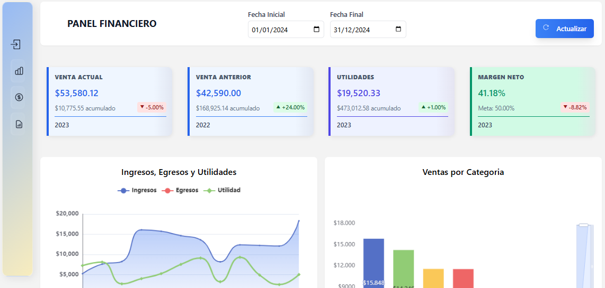

# FinancialDashboard

# 🚀 ERP Executive Dashboard | Web API + Interactive BI



Dashboard de indicadores económicos desarrollado en .NET Core + Web API.


**Solución modular de Business Intelligence** para ERPs tradicionales, proporcionando visualización ejecutiva en tiempo real con integración multiplataforma.

## 🔥 Características Clave
- 📊 **Gráficos interactivos** con ECharts.js
- 🎨 UI responsive con **Tailwind CSS**
- ⚡ Backend eficiente en **.NET 8 Web API**
- 📅 Filtros dinámicos por periodo (mes/año/rangos personalizados)
- 🔄 Compatibilidad con **WinForms via WebView2**
- 📱 Diseño adaptable a dispositivos móviles

## 🛠 Stack Tecnológico
| Frontend              | Backend           | Integración       |
|-----------------------|-------------------|-------------------|
|  |  |  |
|  |  |  |
|  |  |  |

## 📦 Instalación
```bash
# Clonar repositorio
git clone https://github.com/tuusuario/erp-dashboard.git

# Ejecutar API (puerto 5179)
cd src/API
dotnet run

# Abrir interfaz web
cd ../WebApp
open index.html